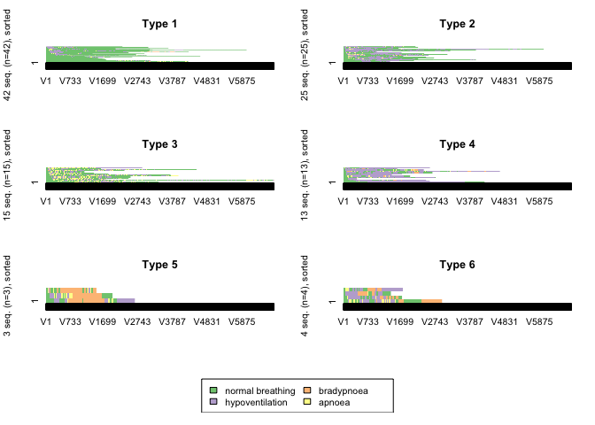

Sequence analysis of capnography waveform abnormalities during nurse-administered procedural sedation and analgesia in the cardiac catheterization laboratory
================

### Click on the binder link to launch an RStudio session and then open and knit `code for publication.RmD` to reproduce the analysis of results presented in the publication.

[](https://mybinder.org/v2/gh/awconway/capnographyssa/master?urlpath=rstudio)

This repository contains the data and code used for statistical analysis.


``` r
library(tidyverse)
library(TraMineR)
library(cluster)
library(WeightedCluster)
library(gt)
library(qwraps2)
```


Setting up dataframe
====================

Load in capnography data
------------------------

``` r
myCapnoData <- read_csv("data.csv")
```

Code to produce Table 1
-----------------------

``` r
options(qwraps2_markup = "markdown")
our_summary1 <-
  list("Age" =
         list("mean (sd)" = ~ qwraps2::mean_sd(Age)),
       "Sex" =
         list("Female" = ~ qwraps2::n_perc0(Sex==1)),
       "Procedure" =
         list("Permanent pacemaker implant or generator change" = ~ qwraps2::n_perc0(procedure == "PPM"),
              "Implantable cardioverter defibrillator implant 
              or generator change"  = ~ qwraps2::n_perc0(procedure == "ICD"),
              "Cardiac resynchronisation therapy"  = ~ qwraps2::n_perc0(procedure == "CRT"),
              "Atrial flutter ablation"  = ~ qwraps2::n_perc0(procedure == "flutter"),
              "Other arrhythmia ablation"  = ~ qwraps2::n_perc0(procedure == "RFA"),
              "Diagnostic electrophysiology study"  = ~ qwraps2::n_perc0(procedure == "EPS"),
              "Loop recorder implant"  = ~ qwraps2::n_perc0(procedure == "Loop recorder implant")),
       "BMI" =
         list("mean (sd)" = ~ qwraps2::mean_sd(BMI, na_rm = TRUE, show_n = "never")),
       "ASA classification status" =
         list("One" = ~ qwraps2::n_perc0(ASA == 1),
              "Two"  = ~ qwraps2::n_perc0(ASA == 2),
              "Three"  = ~ qwraps2::n_perc0(ASA == 3),
              "Four"  = ~ qwraps2::n_perc0(ASA == 4)),
       "Obstructive Sleep Apnoea" =
         list("Yes" = ~ qwraps2::n_perc0(OSA == 1),
              "No"  = ~ qwraps2::n_perc0(OSA == 0)),
        "STOP-BANG Obstructive Sleep Apnoea Risk Classification" =
         list("Low" = ~ qwraps2::n_perc0(STOPBANG == "low", na_rm = TRUE),
              "Moderate"  = ~ qwraps2::n_perc0(STOPBANG == "intermediate", na_rm = TRUE),
              "High"  = ~ qwraps2::n_perc0(STOPBANG == "high", na_rm = TRUE)),
       "Chronic Obstructive Pulmonary Disease" =
         list("Yes" = ~ qwraps2::n_perc0(COPD == 1),
              "No"  = ~ qwraps2::n_perc0(COPD == 0)),
       "Past or present smoker" =
         list("Yes" = ~ qwraps2::n_perc0(Smoker == 1, na_rm = TRUE),
              "No"  = ~ qwraps2::n_perc0(Smoker == 0, na_rm = TRUE)),
       "Charlson Comoridity Index" =
         list("mean (sd)" = ~ qwraps2::mean_sd(CCI, na_rm = TRUE, show_n = "never")),
       "Midazolam total dose (mg)" =
         list("max" = ~ max(Midazolam),
           "mean (sd)" = ~ qwraps2::mean_sd(Midazolam)),
       "Fentanyl total dose (mg)" =
         list("max" = ~ max(Fentanyl),
           "mean (sd)" = ~ qwraps2::mean_sd(Fentanyl)),
       "TcCO2 at baseline (mm Hg)" =
         list("mean (sd)" = ~ qwraps2::mean_sd(PCO2.baseline)),
       "TcCO2 peak (mm Hg)" =
         list("max" = ~ max(PCO2.peak),
              "mean (sd)" = ~ qwraps2::mean_sd(PCO2.peak))
       )

whole <- summary_table(myCapnoData, our_summary1)

grouped <- summary_table(dplyr::group_by(myCapnoData, cluster.CHI), our_summary1)
```

``` r
both <- print(cbind(whole, grouped),
      rtitle = "Summary Statistics",
      cnames = c("Total Sample", "Normal breathing","Hypopnea", "Apnea", "Bradypnea"))
```

<table style="width:100%;">
<colgroup>
<col width="46%" />
<col width="10%" />
<col width="10%" />
<col width="10%" />
<col width="10%" />
<col width="10%" />
</colgroup>
<thead>
<tr class="header">
<th align="left">Summary Statistics</th>
<th align="left">Total Sample</th>
<th align="left">Normal breathing</th>
<th align="left">Hypopnea</th>
<th align="left">Apnea</th>
<th align="left">Bradypnea</th>
</tr>
</thead>
<tbody>
<tr class="odd">
<td align="left"><strong>Age</strong></td>
<td align="left">  </td>
<td align="left">  </td>
<td align="left">  </td>
<td align="left">  </td>
<td align="left">  </td>
</tr>
<tr class="even">
<td align="left">   mean (sd)</td>
<td align="left">72.95 ± 11.28</td>
<td align="left">73.83 ± 11.63</td>
<td align="left">73.21 ± 11.93</td>
<td align="left">70.20 ± 10.46</td>
<td align="left">72.14 ± 7.73</td>
</tr>
<tr class="odd">
<td align="left"><strong>Sex</strong></td>
<td align="left">  </td>
<td align="left">  </td>
<td align="left">  </td>
<td align="left">  </td>
<td align="left">  </td>
</tr>
<tr class="even">
<td align="left">   Female</td>
<td align="left">35 (34)</td>
<td align="left">12 (29)</td>
<td align="left">17 (45)</td>
<td align="left">4 (27)</td>
<td align="left">2 (29)</td>
</tr>
<tr class="odd">
<td align="left"><strong>Procedure</strong></td>
<td align="left">  </td>
<td align="left">  </td>
<td align="left">  </td>
<td align="left">  </td>
<td align="left">  </td>
</tr>
<tr class="even">
<td align="left">   Permanent pacemaker implant or generator change</td>
<td align="left">62 (61)</td>
<td align="left">27 (64)</td>
<td align="left">23 (61)</td>
<td align="left">7 (47)</td>
<td align="left">5 (71)</td>
</tr>
<tr class="odd">
<td align="left">   Implantable cardioverter defibrillator implant</td>
</tr>
<tr class="even">
<td align="left">or generator change</td>
<td align="left">10 (10)</td>
<td align="left">4 (10)</td>
<td align="left">4 (11)</td>
<td align="left">1 (7)</td>
<td align="left">1 (14)</td>
</tr>
<tr class="odd">
<td align="left">   Cardiac resynchronisation therapy</td>
<td align="left">5 (5)</td>
<td align="left">1 (2)</td>
<td align="left">2 (5)</td>
<td align="left">2 (13)</td>
<td align="left">0 (0)</td>
</tr>
<tr class="even">
<td align="left">   Atrial flutter ablation</td>
<td align="left">8 (8)</td>
<td align="left">3 (7)</td>
<td align="left">3 (8)</td>
<td align="left">2 (13)</td>
<td align="left">0 (0)</td>
</tr>
<tr class="odd">
<td align="left">   Other arrhythmia ablation</td>
<td align="left">13 (13)</td>
<td align="left">5 (12)</td>
<td align="left">4 (11)</td>
<td align="left">3 (20)</td>
<td align="left">1 (14)</td>
</tr>
<tr class="even">
<td align="left">   Diagnostic electrophysiology study</td>
<td align="left">3 (3)</td>
<td align="left">2 (5)</td>
<td align="left">1 (3)</td>
<td align="left">0 (0)</td>
<td align="left">0 (0)</td>
</tr>
<tr class="odd">
<td align="left">   Loop recorder implant</td>
<td align="left">1 (1)</td>
<td align="left">0 (0)</td>
<td align="left">1 (3)</td>
<td align="left">0 (0)</td>
<td align="left">0 (0)</td>
</tr>
<tr class="even">
<td align="left"><strong>BMI</strong></td>
<td align="left">  </td>
<td align="left">  </td>
<td align="left">  </td>
<td align="left">  </td>
<td align="left">  </td>
</tr>
<tr class="odd">
<td align="left">   mean (sd)</td>
<td align="left">28.74 ± 5.36</td>
<td align="left">29.92 ± 5.31</td>
<td align="left">28.54 ± 5.09</td>
<td align="left">25.77 ± 3.90</td>
<td align="left">29.32 ± 8.29</td>
</tr>
<tr class="even">
<td align="left"><strong>ASA classification status</strong></td>
<td align="left">  </td>
<td align="left">  </td>
<td align="left">  </td>
<td align="left">  </td>
<td align="left">  </td>
</tr>
<tr class="odd">
<td align="left">   One</td>
<td align="left">11 (11)</td>
<td align="left">4 (10)</td>
<td align="left">5 (13)</td>
<td align="left">2 (13)</td>
<td align="left">0 (0)</td>
</tr>
<tr class="even">
<td align="left">   Two</td>
<td align="left">52 (51)</td>
<td align="left">25 (60)</td>
<td align="left">13 (34)</td>
<td align="left">9 (60)</td>
<td align="left">5 (71)</td>
</tr>
<tr class="odd">
<td align="left">   Three</td>
<td align="left">32 (31)</td>
<td align="left">9 (21)</td>
<td align="left">18 (47)</td>
<td align="left">3 (20)</td>
<td align="left">2 (29)</td>
</tr>
<tr class="even">
<td align="left">   Four</td>
<td align="left">7 (7)</td>
<td align="left">4 (10)</td>
<td align="left">2 (5)</td>
<td align="left">1 (7)</td>
<td align="left">0 (0)</td>
</tr>
<tr class="odd">
<td align="left"><strong>Obstructive Sleep Apnoea</strong></td>
<td align="left">  </td>
<td align="left">  </td>
<td align="left">  </td>
<td align="left">  </td>
<td align="left">  </td>
</tr>
<tr class="even">
<td align="left">   Yes</td>
<td align="left">25 (25)</td>
<td align="left">10 (24)</td>
<td align="left">7 (18)</td>
<td align="left">4 (27)</td>
<td align="left">4 (57)</td>
</tr>
<tr class="odd">
<td align="left">   No</td>
<td align="left">77 (75)</td>
<td align="left">32 (76)</td>
<td align="left">31 (82)</td>
<td align="left">11 (73)</td>
<td align="left">3 (43)</td>
</tr>
<tr class="even">
<td align="left"><strong>STOP-BANG Obstructive Sleep Apnoea Risk Classification</strong></td>
<td align="left">  </td>
<td align="left">  </td>
<td align="left">  </td>
<td align="left">  </td>
<td align="left">  </td>
</tr>
<tr class="odd">
<td align="left">   Low</td>
<td align="left">39 (41)</td>
<td align="left">13 (32)</td>
<td align="left">19 (53)</td>
<td align="left">5 (38)</td>
<td align="left">2 (29)</td>
</tr>
<tr class="even">
<td align="left">   Moderate</td>
<td align="left">26 (27)</td>
<td align="left">12 (30)</td>
<td align="left">9 (25)</td>
<td align="left">3 (23)</td>
<td align="left">2 (29)</td>
</tr>
<tr class="odd">
<td align="left">   High</td>
<td align="left">31 (32)</td>
<td align="left">15 (38)</td>
<td align="left">8 (22)</td>
<td align="left">5 (38)</td>
<td align="left">3 (43)</td>
</tr>
<tr class="even">
<td align="left"><strong>Chronic Obstructive Pulmonary Disease</strong></td>
<td align="left">  </td>
<td align="left">  </td>
<td align="left">  </td>
<td align="left">  </td>
<td align="left">  </td>
</tr>
<tr class="odd">
<td align="left">   Yes</td>
<td align="left">16 (16)</td>
<td align="left">9 (21)</td>
<td align="left">4 (11)</td>
<td align="left">1 (7)</td>
<td align="left">2 (29)</td>
</tr>
<tr class="even">
<td align="left">   No</td>
<td align="left">86 (84)</td>
<td align="left">33 (79)</td>
<td align="left">34 (89)</td>
<td align="left">14 (93)</td>
<td align="left">5 (71)</td>
</tr>
<tr class="odd">
<td align="left"><strong>Past or present smoker</strong></td>
<td align="left">  </td>
<td align="left">  </td>
<td align="left">  </td>
<td align="left">  </td>
<td align="left">  </td>
</tr>
<tr class="even">
<td align="left">   Yes</td>
<td align="left">41 (41)</td>
<td align="left">14 (33)</td>
<td align="left">15 (41)</td>
<td align="left">6 (40)</td>
<td align="left">6 (86)</td>
</tr>
<tr class="odd">
<td align="left">   No</td>
<td align="left">60 (59)</td>
<td align="left">28 (67)</td>
<td align="left">22 (59)</td>
<td align="left">9 (60)</td>
<td align="left">1 (14)</td>
</tr>
<tr class="even">
<td align="left"><strong>Charlson Comoridity Index</strong></td>
<td align="left">  </td>
<td align="left">  </td>
<td align="left">  </td>
<td align="left">  </td>
<td align="left">  </td>
</tr>
<tr class="odd">
<td align="left">   mean (sd)</td>
<td align="left">5.61 ± 2.40</td>
<td align="left">5.52 ± 2.24</td>
<td align="left">5.76 ± 2.09</td>
<td align="left">4.60 ± 2.06</td>
<td align="left">7.43 ± 4.39</td>
</tr>
<tr class="even">
<td align="left"><strong>Midazolam total dose (mg)</strong></td>
<td align="left">  </td>
<td align="left">  </td>
<td align="left">  </td>
<td align="left">  </td>
<td align="left">  </td>
</tr>
<tr class="odd">
<td align="left">   max</td>
<td align="left">6</td>
<td align="left">6</td>
<td align="left">6</td>
<td align="left">5</td>
<td align="left">3</td>
</tr>
<tr class="even">
<td align="left">   mean (sd)</td>
<td align="left">2.05 ± 1.10</td>
<td align="left">1.88 ± 1.14</td>
<td align="left">2.16 ± 1.10</td>
<td align="left">2.20 ± 1.15</td>
<td align="left">2.14 ± 0.69</td>
</tr>
<tr class="odd">
<td align="left"><strong>Fentanyl total dose (mg)</strong></td>
<td align="left">  </td>
<td align="left">  </td>
<td align="left">  </td>
<td align="left">  </td>
<td align="left">  </td>
</tr>
<tr class="even">
<td align="left">   max</td>
<td align="left">125</td>
<td align="left">100</td>
<td align="left">125</td>
<td align="left">125</td>
<td align="left">100</td>
</tr>
<tr class="odd">
<td align="left">   mean (sd)</td>
<td align="left">55.40 ± 24.26</td>
<td align="left">49.40 ± 22.42</td>
<td align="left">58.58 ± 23.38</td>
<td align="left">58.33 ± 29.38</td>
<td align="left">67.86 ± 23.78</td>
</tr>
<tr class="even">
<td align="left"><strong>TcCO2 at baseline (mm Hg)</strong></td>
<td align="left">  </td>
<td align="left">  </td>
<td align="left">  </td>
<td align="left">  </td>
<td align="left">  </td>
</tr>
<tr class="odd">
<td align="left">   mean (sd)</td>
<td align="left">37.48 ± 4.61</td>
<td align="left">37.09 ± 4.12</td>
<td align="left">38.43 ± 4.64</td>
<td align="left">36.27 ± 5.43</td>
<td align="left">37.26 ± 5.38</td>
</tr>
<tr class="even">
<td align="left"><strong>TcCO2 peak (mm Hg)</strong></td>
<td align="left">  </td>
<td align="left">  </td>
<td align="left">  </td>
<td align="left">  </td>
<td align="left">  </td>
</tr>
<tr class="odd">
<td align="left">   max</td>
<td align="left">70.5</td>
<td align="left">55.8</td>
<td align="left">70.5</td>
<td align="left">62.9</td>
<td align="left">57.8</td>
</tr>
<tr class="even">
<td align="left">   mean (sd)</td>
<td align="left">47.23 ± 6.68</td>
<td align="left">44.58 ± 4.95</td>
<td align="left">49.54 ± 7.06</td>
<td align="left">47.73 ± 7.55</td>
<td align="left">49.56 ± 7.27</td>
</tr>
</tbody>
</table>

Respiratory state sequence analysis
===================================

Setting up state sequence object using TraMineR
-----------------------------------------------

``` r
rsa <- read_csv("rsa.csv")
```

``` r
rsa.alphabet1 <- c("0", "1","3", "5")
rsa.labels1 <- c("normal breathing", "hypoventilation","bradypnoea", "apnoea")
rsa.scodes1 <- c("NB", "Hypo", "Brady", "Apn")
rsa.seq1 <- seqdef(rsa, alphabet = rsa.alphabet1, states = rsa.scodes1, 
                   labels = rsa.labels1, left = "DEL", right = "DEL", gaps = "DEL", fill = TRUE)
```

    ##  [>] found missing values ('NA') in sequence data

    ##  [>] preparing 102 sequences

    ##  [>] coding void elements with '%' and missing values with '*'

    ##  [>] state coding:

    ##        [alphabet]  [label]  [long label]

    ##      1  0           NB       normal breathing

    ##      2  1           Hypo     hypoventilation

    ##      3  3           Brady    bradypnoea

    ##      4  5           Apn      apnoea

    ##  [>] 102 sequences in the data set

    ##  [>] min/max sequence length: 391/6831

Chi-squared distance over the full observed timeframe
-----------------------------------------------------

This distance measure produced the most logical clustering solution with clusters of patients whose post-sedation respiratory state sequence was dominiated by "normal breathing", "hypopnoeic hypoventilation", "periods of apnoea" and "bradypnoeic hypoventilation".

First we make a function to test different cluster sizes

``` r
clusterfunction <- function(x){

CHI <- seqdist(rsa.seq1, method = "CHI2", with.missing = TRUE, norm = "auto",  step = max(seqlength(rsa.seq1)))
clusterward.CHI <- agnes(CHI, diss = TRUE, method = "ward")
cl1.3.CHI <- cutree(clusterward.CHI, k = x)
cl1.3fac.CHI <- factor(cl1.3.CHI, labels = paste("Type", 1:x))

#Plot all the sequences within each cluster.

seqIplot(rsa.seq1, group = cl1.3fac.CHI, sortv = "from.start")
}
```

### CHI distance matrix with 3 clusters

``` r
clusterfunction(3)
```


### CHI distance matrix with 5 clusters

``` r
clusterfunction(5)
```


### CHI distance matrix with 6 clusters

``` r
clusterfunction(6)
```



### CHI distance matrix with 4 clusters

Code used to produce Figure 1

``` r
CHI <- seqdist(rsa.seq1, method = "CHI2", with.missing = TRUE, norm = "auto",  step = max(seqlength(rsa.seq1)))
clusterward.CHI <- agnes(CHI, diss = TRUE, method = "ward")
cl1.3.CHI <- cutree(clusterward.CHI, k = 4)
cl1.3fac.CHI <- factor(cl1.3.CHI, labels = paste("Type", 1:4))
seqIplot(rsa.seq1, group = cl1.3fac.CHI, sortv = "from.start",yaxis = FALSE, with.legend=TRUE, xtstep=1000)
```


### Cluster quality

Measures of the quality of the cluster solution were calculated. These measures of cluster quality were not used to aid selection of the number of clusters or the optmial algorithm because on visual inspection, none of the other cluster solutions made clinical sense.

``` r
wcClusterQuality(CHI, clustering = cl1.3fac.CHI)
```

    ## $stats
    ##         PBC          HG        HGSD         ASW        ASWw          CH 
    ##  0.52499382  0.80161249  0.80161249  0.47990380  0.50174989 34.13297724 
    ##          R2        CHsq        R2sq          HC 
    ##  0.51097544 93.83231497  0.74176340  0.07241897 
    ## 
    ## $ASW
    ##              ASW      ASWw
    ## Type 1 0.6374376 0.6460700
    ## Type 2 0.3612490 0.3774208
    ## Type 3 0.4066809 0.4458104
    ## Type 4 0.3357337 0.4306289

In general, the results of the cluster quality measures indicate that a reasonable structure was identified.

PCA
===

Principal Components score for the total doses of midazolam and fentanyl was calculated because these two variables were highly correlated. The scores were added to the dataframe for use in the multivariable distance matrix regression analysis

``` r
p.comps <- myCapnoData %>% 
  select(Fentanyl, Midazolam) %>%
  princomp(cor=TRUE)

myCapnoData <- myCapnoData %>%
  mutate(PCA1 = p.comps$scores[,1] , PCA2 = p.comps$scores[,2])
```

Multivariable distance matrix regression analysis
=================================================

Code to produce Table 2.

``` r
set.seed(1)
diss.multi <- dissmfacw(CHI ~ PCO2.peak + PCO2.baseline + OSA  + Age+ BMI + Sex + DOSA  + PCA1 + PCA2 + Smoker + COPD + CCI + intervention + STOPBANG + Emergency + SPO, data = myCapnoData, R = 1000)
diss.multi.table <- data.frame(diss.multi$mfac)
colnames(diss.multi.table) <- c("Variable", "Pseudo F", "Pseudo R2", "p value")
diss.multi.table <- diss.multi.table %>% 
  mutate(Total  = `Pseudo R2`/diss.multi.table[nrow(diss.multi.table),3])
colnames(diss.multi.table) <- c("Variable", "Pseudo F", "Pseudo R2", "p value", "Proportion of variance explained")
col.order <- c("Variable", "Pseudo F", "Pseudo R2",  "Proportion of variance explained", "p value")
diss.multi.table$Variable <- c("Peak TcCO2", "Baseline TcCO2", "OSA", "Age", "Body mass index", "Sex", "Day surgery admission", "PCA factor 1 of total sedation doses", "PCA factor 2 of total sedation doses", "Past or present smoker", "COPD", "Charlson comorbidity index score", "Patients who received intervention to support respiration", "STOPBANG (low, intermediate or high risk)", "Emergency admission", "Time above SpO2 97%", "Total")
diss.multi.table <- diss.multi.table[,col.order]
round_df <- function(df, digits) {
  nums <- vapply(df, is.numeric, FUN.VALUE = logical(1))

  df[,nums] <- round(df[,nums], digits = digits)

  (df)
}

diss.multi.table <- round_df(diss.multi.table, 3)
kableExtra::kable(diss.multi.table, caption = "Multivariate distance matrix regression analysis")
```

<table>
<caption>
Multivariate distance matrix regression analysis
</caption>
<thead>
<tr>
<th style="text-align:left;">
Variable
</th>
<th style="text-align:right;">
Pseudo F
</th>
<th style="text-align:right;">
Pseudo R2
</th>
<th style="text-align:right;">
Proportion of variance explained
</th>
<th style="text-align:right;">
p value
</th>
</tr>
</thead>
<tbody>
<tr>
<td style="text-align:left;">
Peak TcCO2
</td>
<td style="text-align:right;">
4.358
</td>
<td style="text-align:right;">
0.043
</td>
<td style="text-align:right;">
0.152
</td>
<td style="text-align:right;">
0.002
</td>
</tr>
<tr>
<td style="text-align:left;">
Baseline TcCO2
</td>
<td style="text-align:right;">
1.525
</td>
<td style="text-align:right;">
0.015
</td>
<td style="text-align:right;">
0.053
</td>
<td style="text-align:right;">
0.140
</td>
</tr>
<tr>
<td style="text-align:left;">
OSA
</td>
<td style="text-align:right;">
2.337
</td>
<td style="text-align:right;">
0.023
</td>
<td style="text-align:right;">
0.082
</td>
<td style="text-align:right;">
0.023
</td>
</tr>
<tr>
<td style="text-align:left;">
Age
</td>
<td style="text-align:right;">
0.689
</td>
<td style="text-align:right;">
0.007
</td>
<td style="text-align:right;">
0.024
</td>
<td style="text-align:right;">
0.674
</td>
</tr>
<tr>
<td style="text-align:left;">
Body mass index
</td>
<td style="text-align:right;">
0.936
</td>
<td style="text-align:right;">
0.009
</td>
<td style="text-align:right;">
0.033
</td>
<td style="text-align:right;">
0.460
</td>
</tr>
<tr>
<td style="text-align:left;">
Sex
</td>
<td style="text-align:right;">
0.599
</td>
<td style="text-align:right;">
0.006
</td>
<td style="text-align:right;">
0.021
</td>
<td style="text-align:right;">
0.800
</td>
</tr>
<tr>
<td style="text-align:left;">
Day surgery admission
</td>
<td style="text-align:right;">
1.270
</td>
<td style="text-align:right;">
0.012
</td>
<td style="text-align:right;">
0.044
</td>
<td style="text-align:right;">
0.243
</td>
</tr>
<tr>
<td style="text-align:left;">
PCA factor 1 of total sedation doses
</td>
<td style="text-align:right;">
1.404
</td>
<td style="text-align:right;">
0.014
</td>
<td style="text-align:right;">
0.049
</td>
<td style="text-align:right;">
0.185
</td>
</tr>
<tr>
<td style="text-align:left;">
PCA factor 2 of total sedation doses
</td>
<td style="text-align:right;">
1.608
</td>
<td style="text-align:right;">
0.016
</td>
<td style="text-align:right;">
0.056
</td>
<td style="text-align:right;">
0.134
</td>
</tr>
<tr>
<td style="text-align:left;">
Past or present smoker
</td>
<td style="text-align:right;">
2.793
</td>
<td style="text-align:right;">
0.027
</td>
<td style="text-align:right;">
0.097
</td>
<td style="text-align:right;">
0.010
</td>
</tr>
<tr>
<td style="text-align:left;">
COPD
</td>
<td style="text-align:right;">
1.136
</td>
<td style="text-align:right;">
0.011
</td>
<td style="text-align:right;">
0.040
</td>
<td style="text-align:right;">
0.284
</td>
</tr>
<tr>
<td style="text-align:left;">
Charlson comorbidity index score
</td>
<td style="text-align:right;">
2.626
</td>
<td style="text-align:right;">
0.026
</td>
<td style="text-align:right;">
0.092
</td>
<td style="text-align:right;">
0.021
</td>
</tr>
<tr>
<td style="text-align:left;">
Patients who received intervention to support respiration
</td>
<td style="text-align:right;">
5.700
</td>
<td style="text-align:right;">
0.056
</td>
<td style="text-align:right;">
0.199
</td>
<td style="text-align:right;">
0.001
</td>
</tr>
<tr>
<td style="text-align:left;">
STOPBANG (low, intermediate or high risk)
</td>
<td style="text-align:right;">
0.896
</td>
<td style="text-align:right;">
0.018
</td>
<td style="text-align:right;">
0.063
</td>
<td style="text-align:right;">
0.541
</td>
</tr>
<tr>
<td style="text-align:left;">
Emergency admission
</td>
<td style="text-align:right;">
0.800
</td>
<td style="text-align:right;">
0.008
</td>
<td style="text-align:right;">
0.028
</td>
<td style="text-align:right;">
0.576
</td>
</tr>
<tr>
<td style="text-align:left;">
Time above SpO2 97%
</td>
<td style="text-align:right;">
0.477
</td>
<td style="text-align:right;">
0.005
</td>
<td style="text-align:right;">
0.017
</td>
<td style="text-align:right;">
0.898
</td>
</tr>
<tr>
<td style="text-align:left;">
Total
</td>
<td style="text-align:right;">
1.686
</td>
<td style="text-align:right;">
0.282
</td>
<td style="text-align:right;">
1.000
</td>
<td style="text-align:right;">
0.001
</td>
</tr>
</tbody>
</table>
Sequence index plot of patients who received interventions to support breathing
===============================================================================

Code to produce images in Figure 2

``` r
selection <- c(2,10,12,16,18,20,26,34,46,48,57,76,81)
rsa.seq.interventions <- rsa.seq1[selection,]
seqIplot(rsa.seq.interventions,yaxis=FALSE, sortv = "from.start",axes=F, with.legend=F, ylab = "")
axis(1, at=c(1,1000, 2000, 3000)-.5, labels=c("1", "1000", "2000", "3000"))
```


``` r
seqlegend(rsa.seq.interventions, ncol=2)
```


